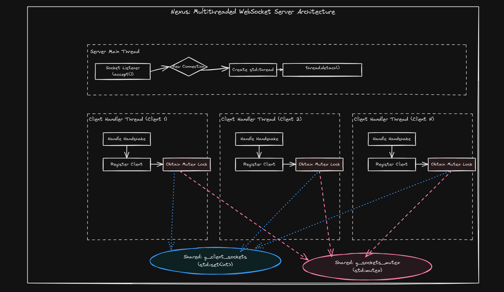
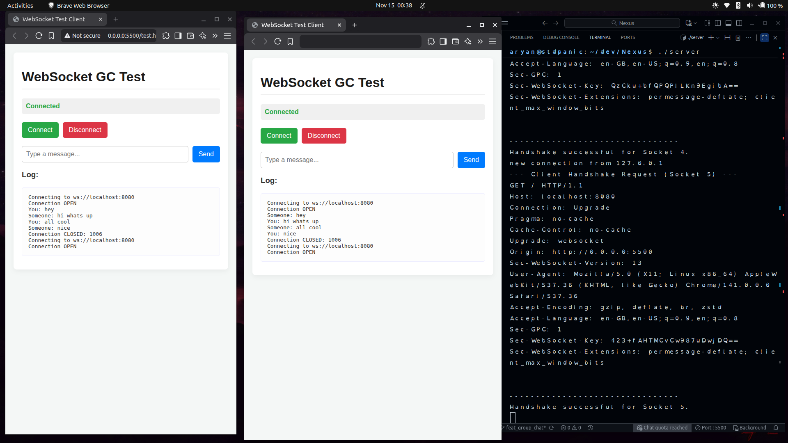
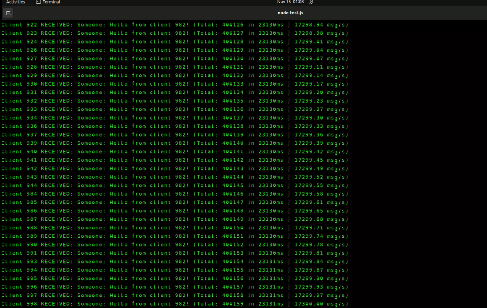

# Nexus: Multithreaded WebSocket ChatApp Server From Scratch

A high-performance, multithreaded WebSocket group chat server built from scratch in C++.

## Overview

  * Implements the full WebSocket protocol (RFC 6455) using **[Pulse](https://github.com/aryan55254/Pulse)** (my own synchronous protocol implementation) as the template for the handshake and frame parsing logic.
  * **Multithreaded Server:** Uses a `thread-per-connection` model to handle thousands of clients concurrently.
  * **Thread-Safe Concurrency:** Implements `std::mutex` and `std::lock_guard` to prevent race conditions when accessing the shared client list.
  * **Group Chat (Broadcast):** Built with a high-performance "Lock, Copy, Unlock, Send" pattern to efficiently broadcast messages.
  * **Load Tested:** Proven to handle **1,000 concurrent clients** with a peak throughput of over **17,000 messages/second**.

## Architecture & Demo

### Architecture Diagram



### Demo Screenshot



### Load Testing Screenshot



## Setup Guide

### 1\. Dependencies

Required packages:

  * g++
  * OpenSSL development library

Install on Ubuntu/Debian:

```bash
sudo apt-get install g++ libssl-dev
```

### 2\. Compilation

Make the compile script executable:

```bash
chmod +x compile.sh
```

Build the server:

```bash
./compile.sh
```

### 3\. Running

Start the server:

```bash
./server
```

You should see: `Server listening on port 8080...`

## Testing

### 1\. Group Chat Test (2 Clients)

1.  Open `test.html` in **two separate browser tabs**.
2.  Click "Connect" in both tabs.
3.  Type a message in one tab and click "Send".
4.  The message will appear as "You: ..." in your tab and "Someone: ..." in the other tab.

### 2\. Load Test (1,000+ Clients)

The `node-test` directory contains a script to simulate concurrent users.

1.  Inside `test.js`, change the `NUM_CLIENTS` constant to `1000`.
2.  Navigate to the test directory:
    ```bash
    cd node-test
    ```
3.  Install the `ws` library:
    ```bash
    npm install ws
    ```
4.  Run the test script (while your C++ server is running):
    ```bash
    node test.js
    ```
5.  Observe the console output as your server handles the 17k msg/s load.